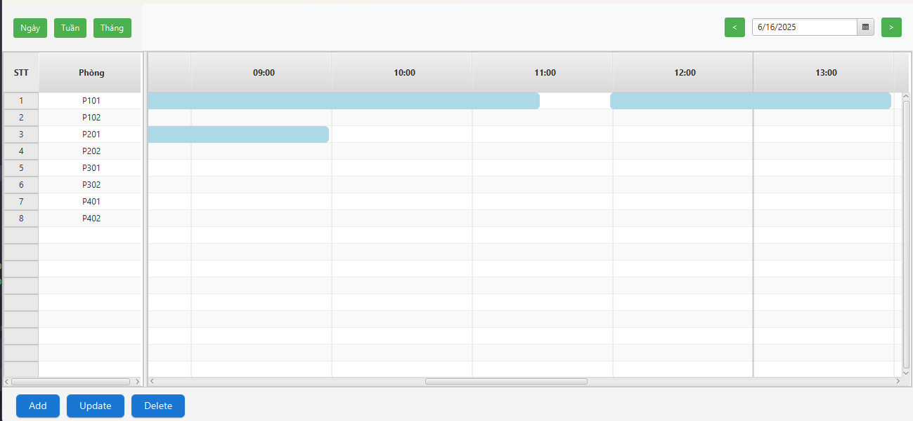
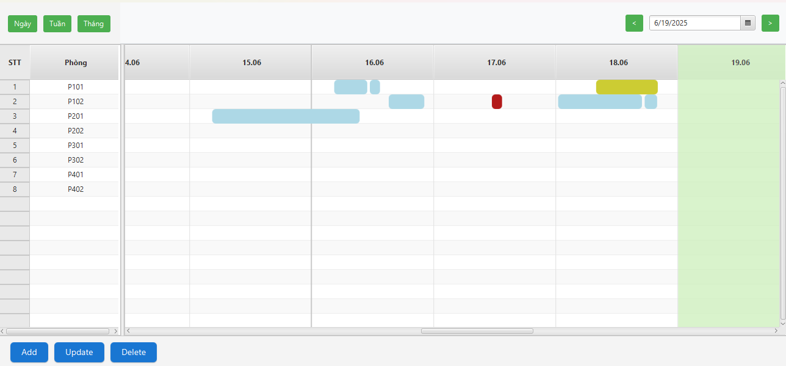
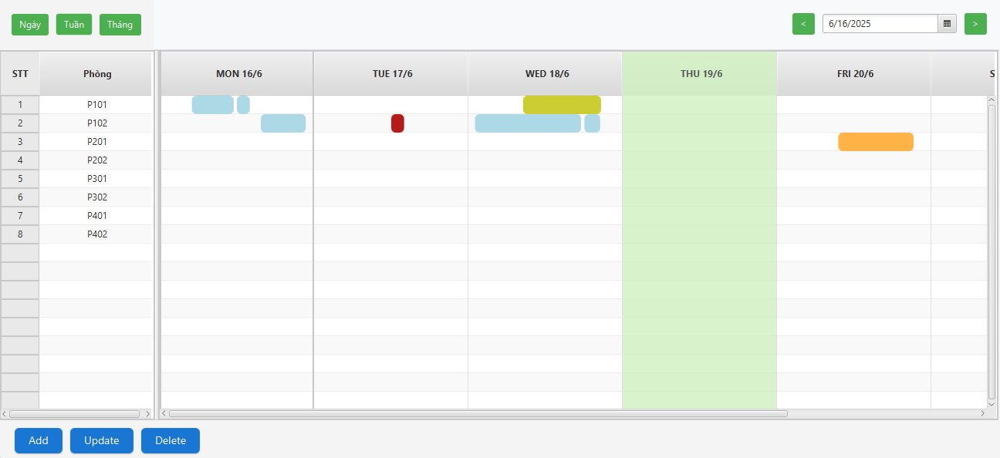

# Calendar Management Application

A JavaFX-based calendar application for managing events and room bookings with different timeline views.

## Features

### Multiple Timeline Views

The application offers three different timeline views to suit your needs:

#### 1. Day View



- Detailed hourly schedule for a single day
- Easy event creation and management
- Clear overview of daily appointments

#### 2. Week View



- Week-at-a-glance perspective
- Track events across multiple days
- Efficient weekly planning

#### 3. Month View



- Full month calendar view
- Long-term planning capability
- Event overview for the entire month

## Key Features

- Event scheduling and management
- Room booking system
- Color-coded events
- Intuitive user interface
- JSON-based data persistence
- Timeline navigation
- Event details and editing

## Technical Stack

- Java
- JavaFX
- JFoenix Material Design Library
- JSON for data storage

## Setup Instructions

### Prerequisites

- Java 8 or higher
- Maven

### Installation Steps

1. Clone the repository

```bash
git clone [repository-url]
```

2. Navigate to project directory

```bash
cd calendar
```

3. Install dependencies using Maven

```bash
./mvnw install
```

4. Run the application

```bash
./mvnw javafx:run
```

## Project Structure

- `src/main/java/com/example/calender` - Main source code
  - `config/` - Configuration and file management
  - `controller/` - UI controllers
  - `models/` - Data models
  - `service/` - Business logic
  - `utils/` - Utility classes
- `src/main/resources` - FXML layouts and styles
  - `data/` - JSON data files
  - `styles/` - CSS stylesheets

## Data Storage

The application uses JSON files to store:

- Events
- Room bookings
- Timeline configurations

## Contributing

Feel free to fork the project and submit pull requests for any improvements.

## License

This project is open source and available under the MIT License.
